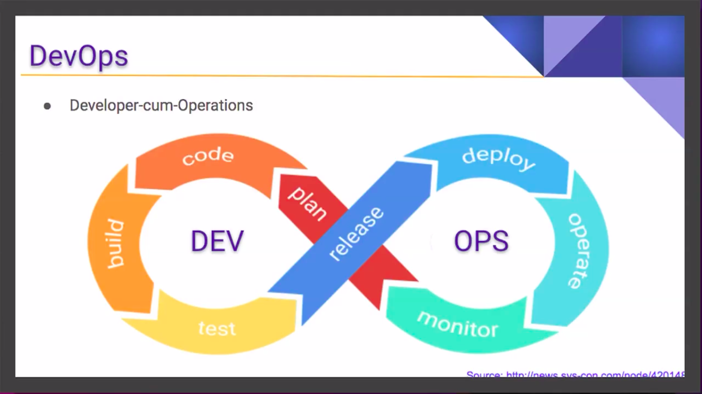
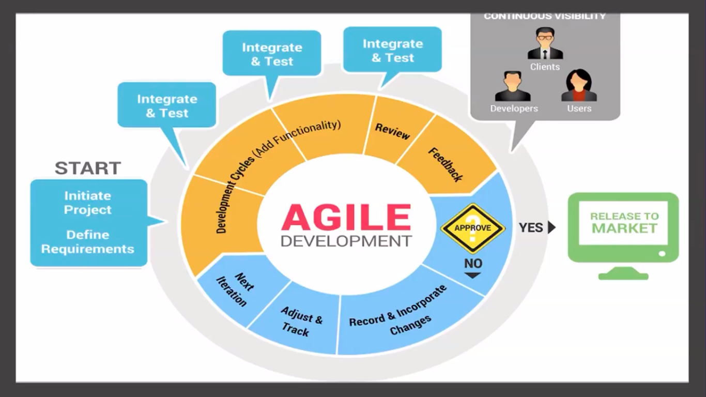
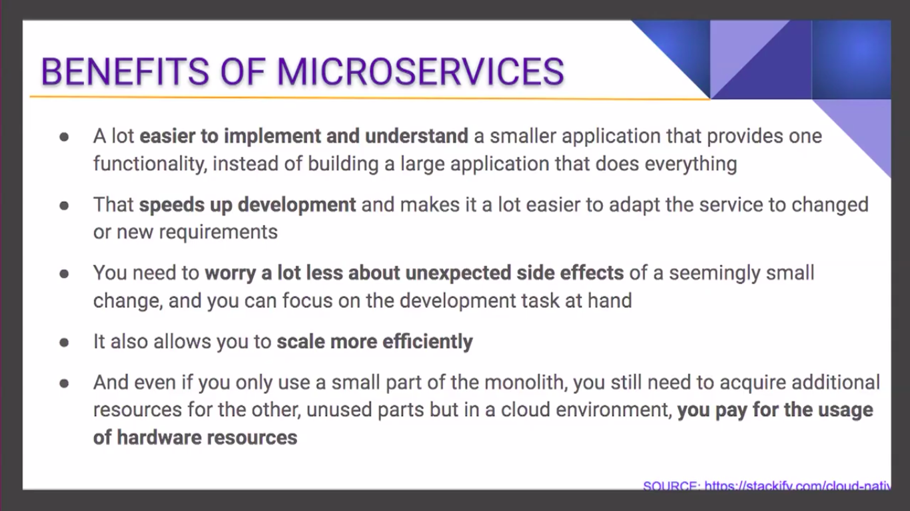
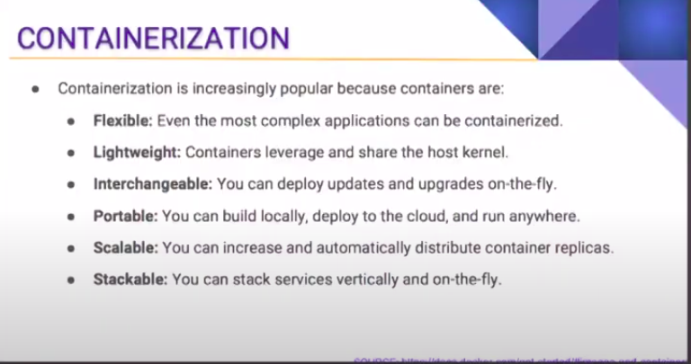

# Introduction to cloud native computing

Every web browser needs server to store data and send data to the client side. For that purpose, every company in old days purchase their server and send data to the client side. This data sends via cloud computing through server, and known as first version of cloud computing.

But in latest technologies companies buy cloud services and use them in their browser i.e amazon provides aws cloud service. In the competition google provides a framework called kubernetes that provides the same service encapsulate inside a docker container, and these services called microservices. Almost every company adopts kubernetes as cloud computing and that's why this updated version is called cloud native computing.

# Monolithic vs Microservices architecture

In monolithic architecture every layer of application is coupled like UI layer, business layer and data layer. This huge structure creates many difficulties in developing the application.

- Debug the error is difficult
- New features adoption complications were too many
- Every developer needs to understand the skeleton of the application to maintain its functionality.

These flaws successfully overcome through microservices architecture with the following advantages:

- Every layer is decoupled and divided into small layers
- Debug the error is very straightforward and simple cause we have to debug the single piece of layer and other will not effected.
- Feature adoption is quite flexible and easy to maintain for every developer.

# What is cloud

A cloud is way of accessing server through internet connection. In simple words every server needs internet connection for data request, and this is done through cloud computing.

There are 3 main types of cloud:

- Public Cloud (Amazon aws cloud which provides rented servers for data storage in cloud)
- Private Cloud (Bank's has a private servers for storing sensitive data which can only access within organization)
- Hybrid Cloud (Private plus public cloud like bank have private servers for storing data also a daily subscriptions data for public)

# Building blocks of Cloud Native Computing

1. Devops (Develop and operate)
   

   The term "devops" means develop the entire application like, plan,code, build and test the application and then deploy the application in cloud and maintain it.

2. Agile Development

   Usually, the application deployment needs every layer perfection and then sends to the user but it takes a long time and sources. If application was not up to the mark we re-create the application from scratch and then deploy it to user.

   In agile development we gradually building application, get feedback from the client or team and update the code accordingly.
   

3. Microservices
   We divide our application into small maintainable pieces and these pieces are called microservices.
   

4. Cloud Computing Platforms

   There are many cloud computing platforms out there that provides different cloud computing i.e private, public. These providers are amazon, google, alibaba and so on.
   They provide edge servers or the server which is distance wise close for users to enhance the speed of user interface and communication.

5. Containers
   A container store the image or instance of an application. This images includes code, configurations, environment variables and all dependencies of the application. The process of converting an image to deployed form is called containerization.

   It has many advantages as shown below
   

6. Orchestration
   When application is containerized and ready to deploy then it's very difficult task to maintain the application data and configs, for this we use an automated powerful tool to manage data after deployment is called kubernetes.

7. Continuous Integration
   When application is deployed then it needs to be updated overtime and re-deploy on same domain, for that we used an automated tool to continuously deploy application after any changes this is called continuous integration and continuous deployment.

# Linux

We need an operating system for to interact with user and system. For this an operating system is used that allows user to interact with the application. It is also used as a translator between user and machine language. There are several different operating systems out there i.e windows and mac. These operating systems are more convenient to use but less throughput than linux operating system.

**Throughput** simply means task running per unit time. If more task running windows or mac will be crash.

## Major functionalities of operating systems

1. Resource management
   Multiple user connected from a single machine.
2. Process management
   Multiple application like media player and browser running in single time
3. Storage management
   Store data in driving using file system.
4. Memory management
   - Every application runs first pass through RAM before execution.
   - RAM allocate memory and send it to CPU
   - CPU execute the program directly.
5. Security management

   User authentication and security of operating systems handled by this management.

## Why Linux is better than Windows

Linux is an open source operating system and continuously update with developers in different regions. It provide best security for servers, reduce maintenance cost.

## Kernel

The kernel is backbone of linux, and it work as bridge between applications and hardware to read data and perform functionality.

## Kernel space and user space

When user run application like media player and browser etc then it runs in user space. But when a user develop and application then it needs Kernel space to run this application through system calls. These calls stored in GNU-C library of Linux and perform operations with calls i.e sudo.

# Linux Commands

- **cd /** - change directory to root
- **cd [directory name]** - general command for change directory
- **ls** - list directory contents
- **cd ..** - change directory to previous stage
- **mkdir [directory name]** - make a new directory
- **touch [file name]** - create a new file
- **vi [file name]** - edit an existing file through build-in vim editor in terminal -> further commands [Vim Commands](https://www.redhat.com/sysadmin/introduction-vi-editor)
- **cat [file name]** - read the file through terminal
- **cp [file name] /path from root to desired directory/** - copy file
- **mv [file name] /path from root to desired directory/** - cut a file
- **rm [file name]** - remove a file or directory
- **man [command name]** - check the manuals for a command
- **find /path from root to desired directory/ ['file name']** - find a file in the directory
- **uname** - username of system
- **uname -a** - username and additional details of system
- **lscpu** - display information about the CPU architecture
- **df -h** - display hardware information in human readable format
- **du -s /path from root to desired directory/ ['file name']** - estimate file space usage in a specific directory
- **date** - show the current date and time
- **cal** - show the calender
- **w** - show the current log in user
- **apt-get install [package name]** - command to install application
- **apt-cache search [keyword ]** - command to search installed application in the system
- **info [command name]** - read the documentation of a specific command
- **bg** - show the background running process
- **free** - show the free space available
- **ps** - show the current running process with PID
- **kill [process id]** - kill a specific process with PID
- **nice** - runs the process with low priority
- **top** - display Linux processes with more details
- **su -** - runs the user a root user
- **shutdown** - turn off the computer
- **sudo and sudo -s** - runs the user as root user for root privileges
- **chmod** - used to change mode of a file and give specific permissions i.e user,group and other. We can use **chmod** in two ways i.e chmod 7777 [file name] and chmod ugo+rwx [file name]. The number system is 0 -> no permission, 1 -> executable permissions, 2 -> write permissions and 4 -> read permissions. Similarly, we use **ugo** as user, group and other to give **rwx** read,write and executable permissions.
- **uname** -> username, **uptime** -> running time of computer, **uname -srv** -> system name and details, **cd ..** -> jump in previous directory, **pwd** -> print working directory,**hostname** -> i.e hmzeshan, **hostname -i** -> IP address, **lscpu** -> detailed information about the system core hardware etc.
- **alias as [ name ]="command to execute"** - used to make a snippet of commands in a short manner. We can also remove alias by **unalias [alias name]**.
- **type [command name]** - used to tell the command location.
